# Вказівники: примітивна демонстрація програми у пам'яті

Давайте спробуємо продемонструвати візуально, як виглядає робота з вказівниками та пам'яттю у програмі С++. Зауважте, що візуалізація навмисно спрощена і лише дуже примітивно \(але не достовірно!\) демонструє, що насправді відбувається. 

Звичайно, як насправді організована пам'ять на різних рівнях архітектури комп'ютера - то окрема складна тема. Але, з точки зору програміста, який доступається до пам'яті з програми на мові С++ - все виглядає саме так. На малюнку вище, ми розглянемо уявну область пам'яті. Кожна з комірок може містити значення \(за замовчуванням, у комірці містяться випадкові дані, що позначено `???`\). Кожна така комірка має унікальну адресу у пам'яті \(у прикладі ми маємо адреси з `0x00` до `0x1F`\).

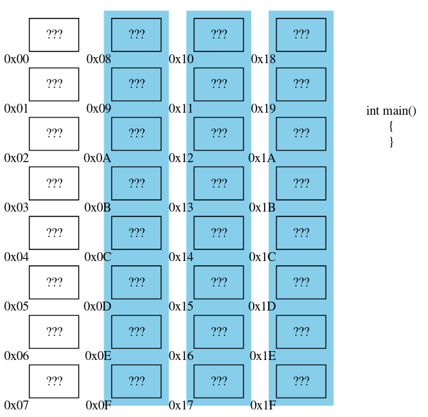

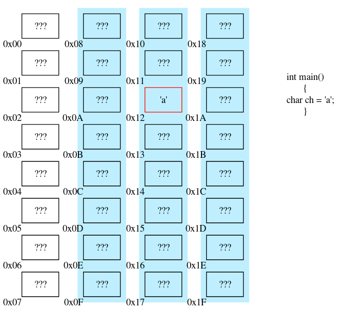

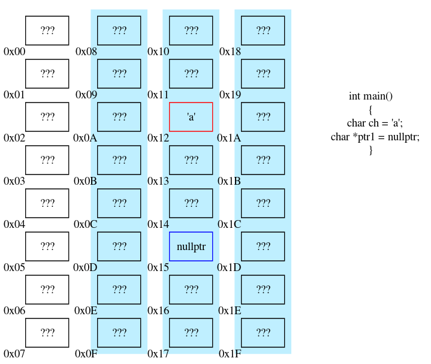

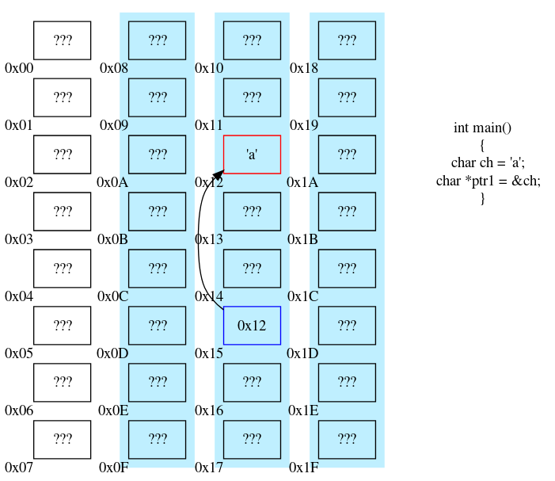

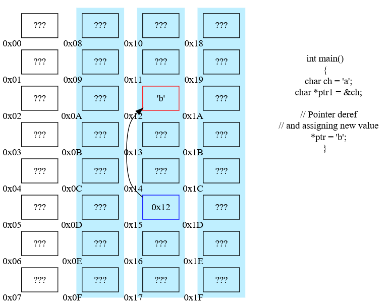

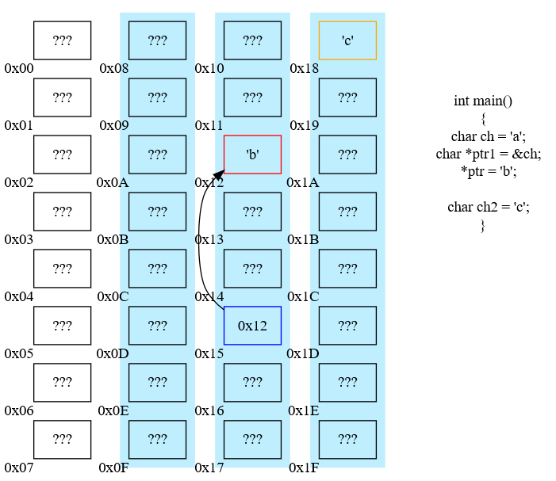

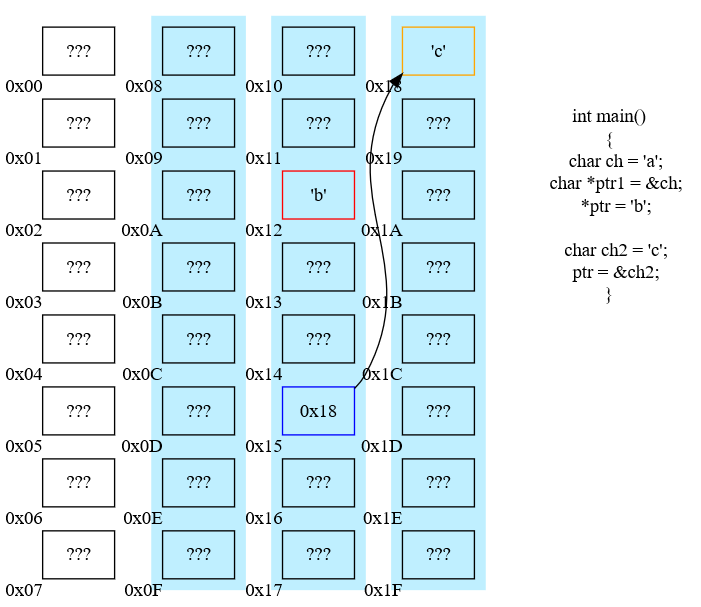

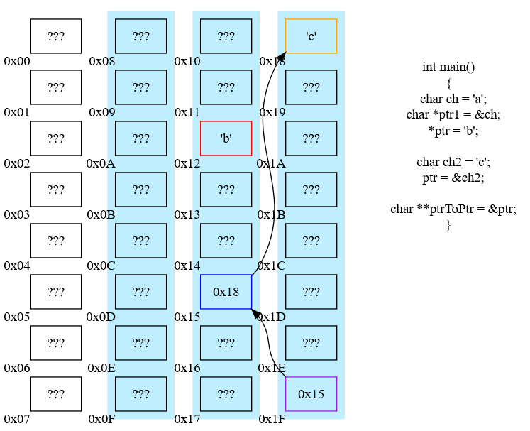

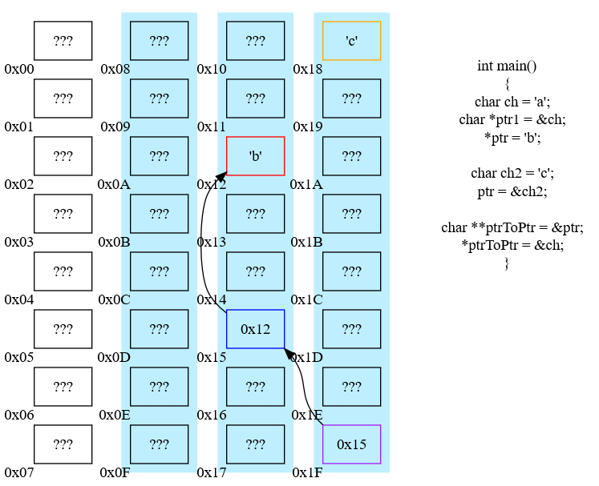

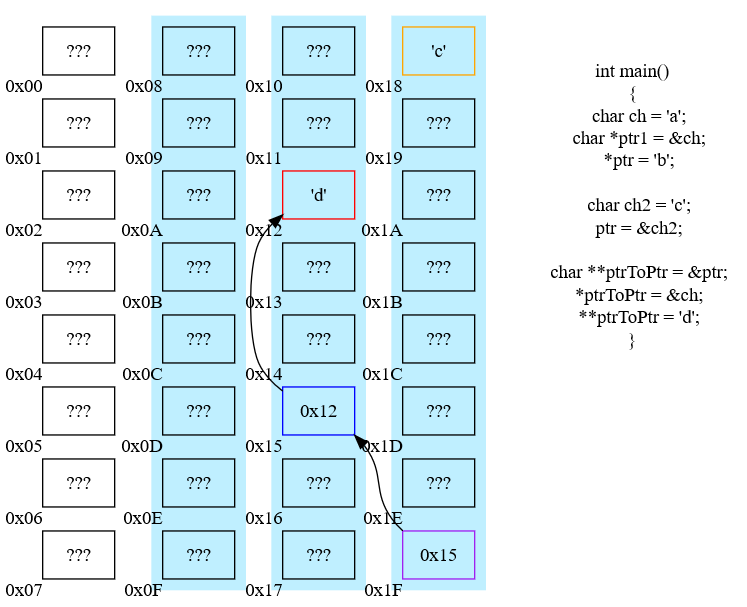

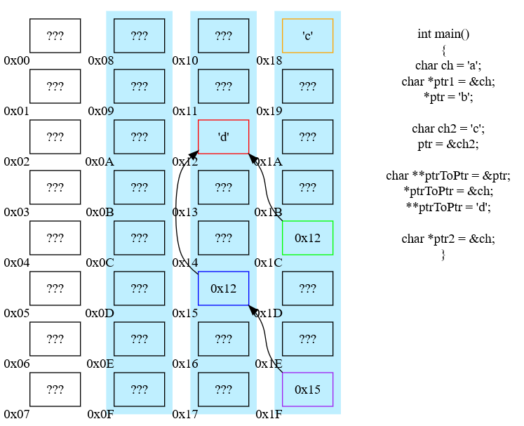

