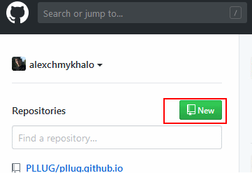
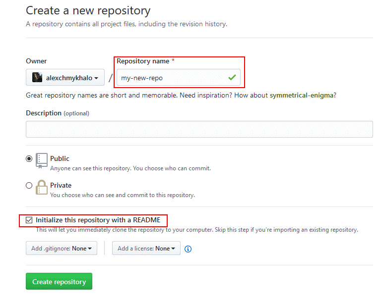
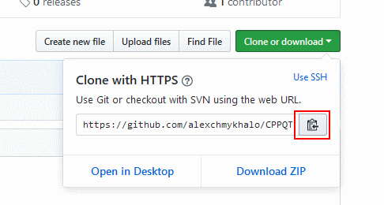

# Створюємо репозиторій та заливаємо на GitHub

## Створюємо репозиторій

Для того щоб створити власний репозиторій — зареєструйтеся на GitHub: [https://github.com/](https://github.com/)

1. Залогінтеся, та зайдіть на головну сторінку GitHub.
2. Натисніть на конпку створення нового репозиторію. 



   3. Оберіть ім’я для репозиторію \(_Repository name_\).



   4.При створенні нового репозиторію оберіть _**“Initialize this repository with a README”**_. Це ініціалізує репозиторій та дасть змогу одразу ж клонувати його.

## Сценарій 1: створюємо репозиторій на GitHub та клонуємо його

1. Скопіюйте адресу вашого нового репозаторію \(наприклад: `https://github.com/user/test-project.git`\). 



   2. Відкрийте консоль. Перейдіть у директорію де буде знаходитись ваш проект.

   3. Виконайте команду `git clone https://адреса_репозиторію`.

   4. Перейдіть у теку репозиторія. Тепер можна розпочинати роботу.

```bash
~ pwd
/home/user

~ mkdir projects

~ cd projects

~ pwd
/home/user/projects

~ git clone https://github.com/user/test-project.git
Cloning into 'test-project'...
remote: Counting objects: 3, done.
remote: Total 3 (delta 0), reused 0 (delta 0), pack-reused 0
Unpacking objects: 100% (3/3), done.
Checking connectivity... done.

~ ls
test-project

~ cd test-project 

~ ls
README.md
```

У наведеному вище прикладі ми:

* Вивели поточну директорію
* Створили у поточній директорії нову теку з назвою projects
* Перейшли у теку projects
* Вивели поточну директорію ще раз для перевірки де ми знаходимось
* Клонували наш репозиторій Git
* Переглянули список директорій, щоб побачити, як називається директорія нашого Git  репозиторію
* Перейшли в теку репозиторію 
* Вивели список файлів у теці репозиторію

## Сценарій 2: створюємо репозиторій локально та зв'язуємо з віддаленим на GitHub

```bash
~ pwd
/home/user

~ mkdir projects

~ cd projects

~ pwd
/home/user/projects

~ git init
Initialized empty Git repository in C:/MSYS2_Cmder/vendor/msys64/home/test/test-project/.git/

~ touch README.md

~ git add README.md

~ git commit -m "Initial commit."
[master (root-commit) 3637301] Initial commit.
 1 file changed, 0 insertions(+), 0 deletions(-)
 create mode 100644 README.md

~ git remote add origin https://github.com/alexchmykhalo/test-project.git

~ git push -u origin master
Username for 'https://github.com': user
Password for 'https://user@github.com': 
Counting objects: 3, done.
Writing objects: 100% (3/3), 218 bytes | 218.00 KiB/s, done.
Total 3 (delta 0), reused 0 (delta 0)
To https://github.com/alexchmykhalo/test2.git
 * [new branch]      master -> master
Branch 'master' set up to track remote branch 'master' from 'origin'.
```

У наведеному вище прикладі ми:

* Вивели поточну директорію
* Створили у поточній директорії нову теку з назвою `projects`
* Перейшли у теку `projects`
* Вивели поточну директорію ще раз для перевірки де ми знаходимось
* Створили новий репозиторій Git
* Створили новий файл `README.md`
* Додали файл `README.md` до наступного коміту
* Закомітили зміни
* Додали віддалений репозиторій, створений на GitHub \(тобто, у той репозиторій ми будемо надсилати зміни\)
* Надіслали зміни у віддалений репозиторій

## Створюємо програму, "комітимо"\(_commit_\) зміни

Додамо головний файл нашої програми: `main.cpp`.

```bash
~ touch main.cpp
```

Також ми можемо змінити нашу програму \(файл `main.cpp`\), як завгодно.

Тепер відкриємо консоль та перевіримо статус репозиторію за допомогою команди `git status`:

```bash
~ git status
On branch master
Your branch is up-to-date with 'origin/master'.
Untracked files:
  (use "git add <file>..." to include in what will be committed)

        main.cpp

nothing added to commit but untracked files present (use "git add" to track)
```

Ми бачимо, що ми маємо кілька файлів, які не є під контролем Git \(_Untracked files_\). Додамо ці файли до наступного коміту з допомогою команди `git add`:

```bash
~ git add main.cpp
~ git status
On branch master
Your branch is up-to-date with 'origin/master'.
Changes to be committed:
  (use "git reset HEAD <file>..." to unstage)

        new file:   main.cpp
```

Тепер ми бачимо, що файли з нашого проекту будуть додані до наступного коміту \(_Changes to be committed_\).

Тепер ми зробити коміт з допомогою команди `git commit -m “коментар”`.

```bash
% git commit -m "Added project files."
[master 275127f] Added project files.
 3 files changed, 90 insertions(+)
 create mode 100644 main.cpp
```

Для того, щоб завантажити \(“залити”\) зміни на GitHub \(на віддалений репозиторій\), виконаємо команду `git push`. Під час виконання цієї команди вам необхідно буде ввести свій логін та пароль до GitHub.

```bash
% git push
Username for 'https://github.com': user
Password for 'https://user@github.com': 
Counting objects: 5, done.
Delta compression using up to 8 threads.
Compressing objects: 100% (5/5), done.
Writing objects: 100% (5/5), 913 bytes | 0 bytes/s, done.
Total 5 (delta 0), reused 0 (delta 0)
To https://github.com/user/test-project.git
   fef3301..275127f  master -> master
```


Для викладача: візуальне демо, як працює Git під час розробки проекту

Демо візуальзіція: [https://learngitbranching.js.org/?NODEMO](https://learngitbranching.js.org/?NODEMO)

Сценарій демо:

> ```bash
> git clone
> git commit
> git commit
> git push
> git commit
> git commit
> git fakeTeamwork
> git fakeTeamwork
> git push
> git pull
> git push
> ```


